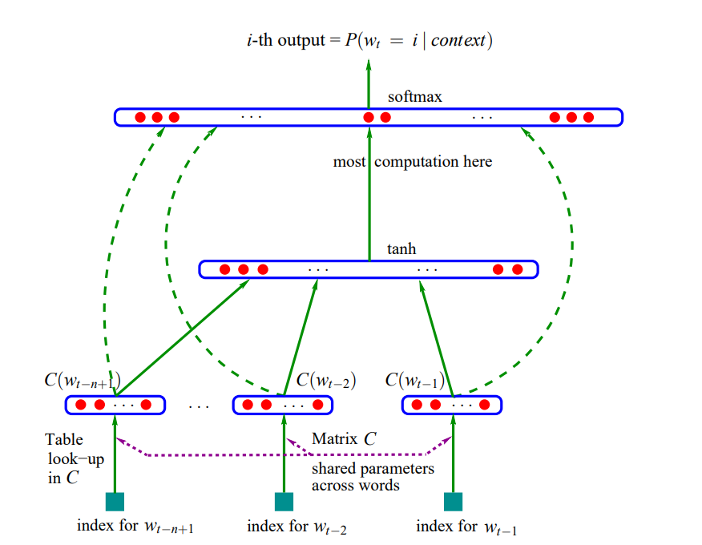
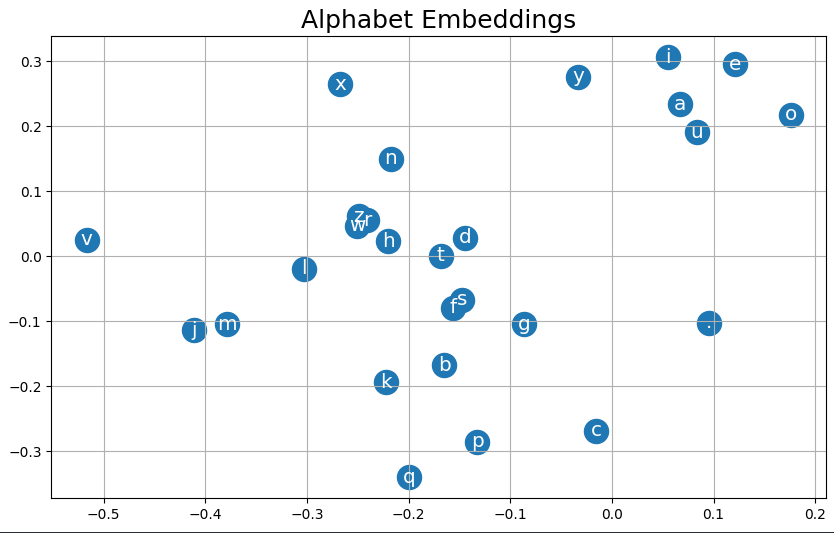
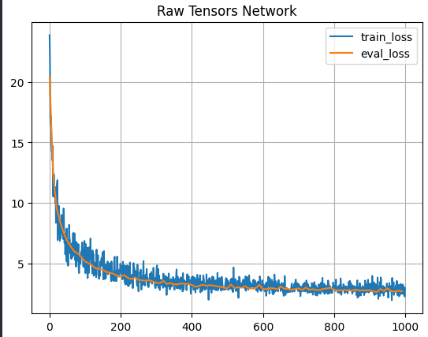
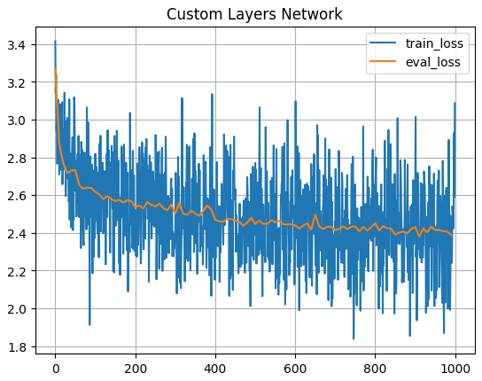
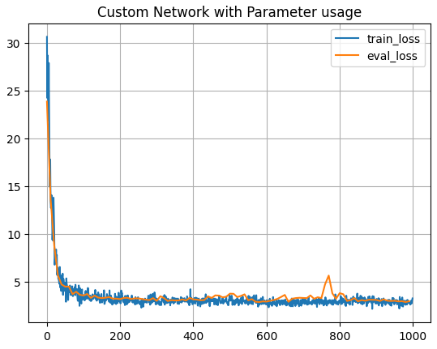
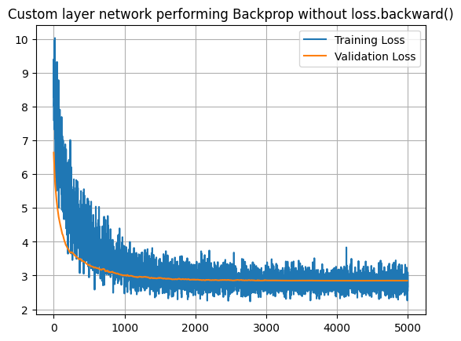
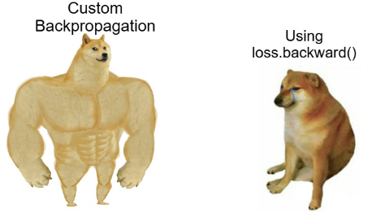

# MLP Character Level Language Models

Character level language model build with a simple Multi Layer Perceptron.

## 🚀 About This Project

This implementation follows Andrej Karpathy’s tutorial of `makemore` and the Bengio et. al. paper `A Neural Probabilistic Language Model` ([Youtube Link](https://github.com/karpathy/makemore) , [Paper Link](https://www.jmlr.org/papers/volume3/bengio03a/bengio03a.pdf)) on building a character language model
from ground up.

Andrej lecture provides a step by step walkthrough of implementing a character level language model using a Multi Layer Perceptron (MLP), inspired by Bengio et al. (2003). It starts with an introduction and a review of the foundational paper, then covers the process of building a training dataset suitable for character-level modeling.

The below image is the embeddings projection with 2 dimensions that came out from C Layer after trained on the dataset.

## Networks

There are **3 implementations of the same network** on this repo that you can observe in experiment notebook.

- **Raw Tensors** Network
- **Custom Layers** Network
- **Parameter Usage** Network

Experiment notebook `experiment.ipynb` contains step-by-step runs, training loops and visualizations for all three implementations.

All three implementations showcase the same training response achieving best loss around at 2.5.

You can see though that second network with custom layers is starting from a better point and that is due to better initialization of layers.

## Custom backpropagation

In the notebook `backprop_ninja.ipynb`, a step by step manual backpropagation was executed, **without relying on PyTorch's loss.backward()** method, to provide a deeper understanding of how gradients are computed and applied. The result of training are clearly showcasing optimization.

